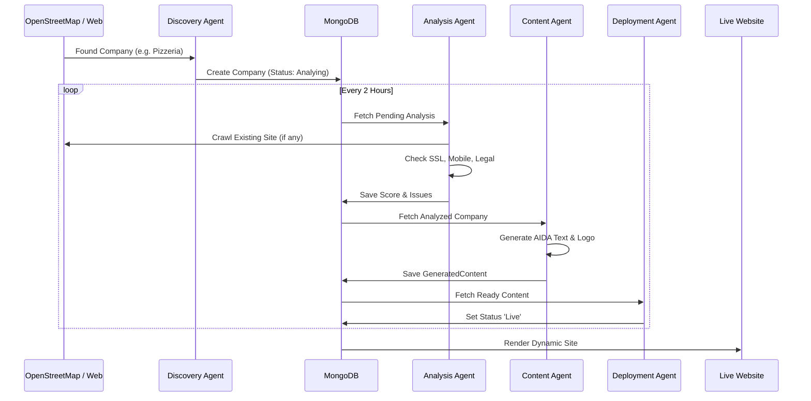

# Autonomous Website Deployment Platform - System Documentation

## 1. Overview
The **Autonomous Deployment Platform** is a fully automated system designed to discover local businesses, analyze their web presence, generate modern, legally compliant websites, and deploy them to production subdomains (`*.minicon.eu`).

**Goal:** To provide an end-to-end "Web Agency on Autopilot".

## 2. Architecture & Workflow

The system operates as a pipeline of autonomous intelligent agents.

### System Architecture
The following diagram illustrates the hybrid architecture between the local Development Environment (where Agents run) and the Production Server (where data and sites live).

```mermaid
graph TB
    subgraph "Local / Dev Environment (Gemini)"
        A[Discovery Agent]
        B[Analysis Agent]
        C[Content Agent]
        D[Deployment Agent]
        E[Sales Agent]
        Cron[OpenClaw Cron]
    end

    subgraph "Tunnel / Network"
        SSH[SSH Tunnel :27018 -> :27017]
    end

    subgraph "Production (minicon-web / Hetzner)"
        LB[Traefik Reverse Proxy]
        Hub[Minicon Hub (Next.js)]
        DB[(MongoDB)]
        
        Sites[Wildcard Sites *.minicon.eu]
    end

    Cron --> A & B & C & D & E
    A & B & C & D & E --Write Data--> SSH --Forward--> DB
    LB --Route--> Hub
    Hub --Read Data--> DB
    Hub --Render--> Sites
    
    style DB fill:#f9f,stroke:#333,stroke-width:2px
    style Hub fill:#ccf,stroke:#333,stroke-width:2px
```

### Autonomous Pipeline Process
The logical flow of data from discovery to a live website.



### Agent Orchestration & Runtime 🧠

The intelligence of the platform is strictly separated from the production infrastructure.

*   **Orchestrator:** **OpenClaw** (running the `Gemini` agent session).
    *   OpenClaw manages the state, memory, and task dispatching.
    *   It utilizes internal **Cron Jobs** to trigger pipelines every 2 hours.
*   **Runtime Environment:** **Local Development Environment** (Dev Server / Workstation).
    *   **Security Policy:** AI Agents do NOT run on the production server (`minicon-web`) to minimize attack surface and resource load.
    *   **Connectivity:** Agents connect to the production MongoDB via a secure **SSH Tunnel** (Port 27018 -> 27017).
*   **Why this architecture?**
    1.  **Security:** Production keys and agent logic stay off the public web server.
    2.  **Performance:** Heavy AI processing (LLM calls, scraping) happens off-site, not slowing down customer websites.
    3.  **Control:** Human-in-the-loop validation is easier in the dev environment.

### Phase 1: Discovery (The Scout) 🕵️‍♂️
*   **Agent:** `Discovery Agent`
*   **Source:** OpenStreetMap (Overpass API)
*   **Target:** Local businesses (Restaurants, Craftsmen, Retail) in a specific region (e.g., Dahn).
*   **Action:**
    *   Fetches real-world data (Name, Address, Industry).
    *   Checks for existing websites.
    *   Creates a `Company` record in the MongoDB database.

### Phase 2: Analysis (The Auditor) ⚖️
*   **Agent:** `Analysis Agent`
*   **Action:**
    *   **Technical Check:** SSL, Mobile Responsiveness, SEO Score.
    *   **Legal Check:** Scans for "Impressum", "Datenschutzerklärung" (DSGVO), and "Cookie Banner".
    *   **Scoring:** Calculates a 0-100 score. Missing legal pages result in severe penalties.
*   **Output:** `WebsiteAnalysis` record.

### Phase 3: Content Generation (The Creator) ✍️
*   **Agent:** `Generation Agent`
*   **Action:**
    *   **Content:** Generates AIDA-structured text (Hero, Features, About) customized for the industry.
    *   **Legal:** Generates specific legal texts (Impressum, Privacy Policy) based on company data.
    *   **Design:** Creates prompts for Logos and defines Color Schemes.
*   **Output:** `GeneratedContent` record.

### Phase 4: Construction (The Builder) 🏗️
*   **Agent:** `Structure Agent` & `Deployment Agent`
*   **Requirement:** Full multi-page website, not just a landing page.
*   **Structure:**
    *   `/` (Home - AIDA optimized)
    *   `/leistungen` (Services)
    *   `/kontakt` (Contact)
    *   `/impressum` (Legal Notice)
    *   `/datenschutz` (Privacy Policy)
*   **Compliance:** Implements a functional **Cookie Consent Banner** that blocks non-essential scripts until accepted.

### Phase 5: Deployment (The Engineer) 🚀
*   **Infrastructure:**
    *   **Server:** `minicon-web` (Hetzner)
    *   **Routing:** Traefik Reverse Proxy with Wildcard support (`*.minicon.eu`).
    *   **App:** Next.js (App Router) rendering dynamic content from MongoDB.
*   **CI/CD:**
    *   GitHub Actions builds Docker image -> Pushes to GHCR.
    *   Production server pulls image and restarts.

### Phase 6: Sales (The Closer) 💼
*   **Agent:** `Sales Agent`
*   **Action:** Generates personalized pitch emails referencing specific analysis findings (e.g., "Your site lacks a cookie banner").

## 3. Data Model (MongoDB/Prisma)

*   **Company:** Master data (Name, Domain, Address).
*   **WebsiteAnalysis:** Audit results & Score.
*   **GeneratedContent:** AI-written text, design assets, and structure definitions.
*   **Deployment:** Status tracking (Queued -> Live) and URL.

## 4. Operational Guidelines

*   **Autonomy:** Agents run on the development environment and push data to the production MongoDB via secure tunnel.
*   **Updates:** The Hub (`hub.minicon.eu`) reflects the live state of the database.
*   **Compliance First:** No website goes live without a valid Impressum and Privacy Policy.

## 5. Future Roadmap
*   **Payment Integration:** Automated Stripe checkout for customers to "claim" their site.
*   **Repo Eject:** Automated creation of a standalone GitHub repository for paying customers.
