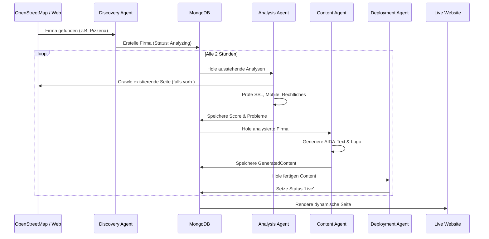

# Autonome Website-Deployment-Plattform - Systemdokumentation

## 1. Überblick
Die **Autonome Deployment-Plattform** ist ein vollautomatisiertes System, das lokale Unternehmen entdeckt, ihre Webpräsenz analysiert, moderne, rechtskonforme Websites generiert und auf Produktions-Subdomains (`*.minicon.eu`) bereitstellt.

**Ziel:** Eine End-to-End "Web-Agentur auf Autopilot".

## 2. Architektur & Arbeitsablauf

Das System arbeitet als Pipeline autonomer intelligenter Agenten.

### Systemarchitektur
Das folgende Diagramm veranschaulicht die hybride Architektur zwischen der lokalen Entwicklungsumgebung (wo Agenten laufen) und dem Produktionsserver (wo Daten und Websites liegen).

```mermaid
graph TB
    subgraph "Lokal / Dev-Umgebung (Gemini)"
        A[Discovery Agent]
        B[Analysis Agent]
        C[Content Agent]
        D[Deployment Agent]
        E[Sales Agent]
        Cron[OpenClaw Cron]
    end

    subgraph "Tunnel / Netzwerk"
        SSH[SSH Tunnel :27018 -> :27017]
    end

    subgraph "Produktion (minicon-web / Hetzner)"
        LB[Traefik Reverse Proxy]
        Hub[Minicon Hub (Next.js)]
        DB[(MongoDB)]
        
        Sites[Wildcard Sites *.minicon.eu]
    end

    Cron --> A & B & C & D & E
    A & B & C & D & E --Schreibt Daten--> SSH --Weiterleitung--> DB
    LB --Route--> Hub
    Hub --Liest Daten--> DB
    Hub --Rendert--> Sites
    
    style DB fill:#f9f,stroke:#333,stroke-width:2px
    style Hub fill:#ccf,stroke:#333,stroke-width:2px
```

### Autonomer Pipeline-Prozess
Der logische Datenfluss von der Entdeckung bis zur Live-Website.



### Agenten-Orchestrierung & Laufzeitumgebung 🧠

Die Intelligenz der Plattform ist strikt von der Produktionsinfrastruktur getrennt.

*   **Orchestrator:** **OpenClaw** (führt die `Gemini` Agenten-Session aus).
    *   OpenClaw verwaltet Status, Speicher und Aufgabenverteilung.
    *   Es nutzt interne **Cronjobs**, um Pipelines alle 2 Stunden zu triggern.
*   **Laufzeitumgebung:** **Lokale Entwicklungsumgebung** (Dev Server / Workstation).
    *   **Sicherheitsrichtlinie:** KI-Agenten laufen NICHT auf dem Produktionsserver (`minicon-web`), um die Angriffsfläche und Ressourcenlast zu minimieren.
    *   **Konnektivität:** Agenten verbinden sich mit der Produktions-MongoDB über einen sicheren **SSH-Tunnel** (Port 27018 -> 27017).
*   **Warum diese Architektur?**
    1.  **Sicherheit:** Produktionsschlüssel und Agentenlogik bleiben fern vom öffentlichen Webserver.
    2.  **Performance:** Rechenintensive KI-Prozesse (LLM-Aufrufe, Scraping) finden extern statt und verlangsamen keine Kundenwebsites.
    3.  **Kontrolle:** Human-in-the-loop Validierung ist in der Dev-Umgebung einfacher.

### Phase 1: Entdeckung (Der Scout) 🕵️‍♂️
*   **Agent:** `Discovery Agent`
*   **Quelle:** OpenStreetMap (Overpass API)
*   **Ziel:** Lokale Unternehmen (Restaurants, Handwerker, Einzelhandel) in einer bestimmten Region (z.B. Dahn).
*   **Aktion:**
    *   Ruft Echtdaten ab (Name, Adresse, Branche).
    *   Prüft auf bestehende Webseiten.
    *   Erstellt einen `Company`-Eintrag in der MongoDB-Datenbank.

### Phase 2: Analyse (Der Auditor) ⚖️
*   **Agent:** `Analysis Agent`
*   **Aktion:**
    *   **Technik-Check:** SSL, Mobile Responsiveness, SEO-Score.
    *   **Rechts-Check:** Scannt nach "Impressum", "Datenschutzerklärung" (DSGVO) und "Cookie Banner".
    *   **Bewertung:** Berechnet einen Score von 0-100. Fehlende rechtliche Seiten führen zu massiven Abzügen.
*   **Output:** `WebsiteAnalysis`-Eintrag.

### Phase 3: Content-Generierung (Der Schöpfer) ✍️
*   **Agent:** `Generation Agent`
*   **Aktion:**
    *   **Inhalt:** Generiert AIDA-strukturierten Text (Hero, Features, Über uns), angepasst an die Branche.
    *   **Rechtliches:** Generiert spezifische Rechtstexte (Impressum, Datenschutz) basierend auf Firmendaten.
    *   **Design:** Erstellt Prompts für Logos und definiert Farbschemata.
*   **Output:** `GeneratedContent`-Eintrag.

### Phase 4: Konstruktion (Der Baumeister) 🏗️
*   **Agent:** `Structure Agent` & `Deployment Agent`
*   **Anforderung:** Vollständige Multi-Page-Website, nicht nur eine Landingpage.
*   **Struktur:**
    *   `/` (Startseite - AIDA optimiert)
    *   `/leistungen` (Services)
    *   `/kontakt` (Kontakt)
    *   `/impressum` (Impressum)
    *   `/datenschutz` (Datenschutzerklärung)
*   **Compliance:** Implementiert einen funktionalen **Cookie Consent Banner**, der nicht-essenzielle Skripte blockiert, bis zugestimmt wurde.

### Phase 5: Deployment (Der Ingenieur) 🚀
*   **Infrastruktur:**
    *   **Server:** `minicon-web` (Hetzner)
    *   **Routing:** Traefik Reverse Proxy mit Wildcard-Support (`*.minicon.eu`).
    *   **App:** Next.js (App Router) rendert dynamische Inhalte aus MongoDB.
*   **CI/CD:**
    *   GitHub Actions baut das Docker-Image -> Pusht zu GHCR.
    *   Produktionsserver zieht das Image und startet neu.

### Phase 6: Vertrieb (Der Verkäufer) 💼
*   **Agent:** `Sales Agent`
*   **Aktion:** Generiert personalisierte Pitch-E-Mails, die sich auf spezifische Analyseergebnisse beziehen (z.B. "Ihrer Seite fehlt ein Cookie-Banner").

## 3. Datenmodell (MongoDB/Prisma)

*   **Company:** Stammdaten (Name, Domain, Adresse).
*   **WebsiteAnalysis:** Audit-Ergebnisse & Score.
*   **GeneratedContent:** KI-geschriebene Texte, Design-Assets und Strukturdefinitionen.
*   **Deployment:** Statusverfolgung (Warteschlange -> Live) und URL.

## 4. Betriebsrichtlinien

*   **Autonomie:** Agenten laufen in der Entwicklungsumgebung und pushen Daten über einen sicheren Tunnel in die Produktions-MongoDB.
*   **Updates:** Der Hub (`hub.minicon.eu`) spiegelt den Live-Status der Datenbank wider.
*   **Compliance First:** Keine Website geht ohne gültiges Impressum und Datenschutzerklärung online.

## 5. Zukünftige Roadmap
*   **Zahlungsintegration:** Automatisierter Stripe-Checkout für Kunden, um ihre Seite zu "beanspruchen".
*   **Repo Eject:** Automatisierte Erstellung eines eigenständigen GitHub-Repositories für zahlende Kunden.
